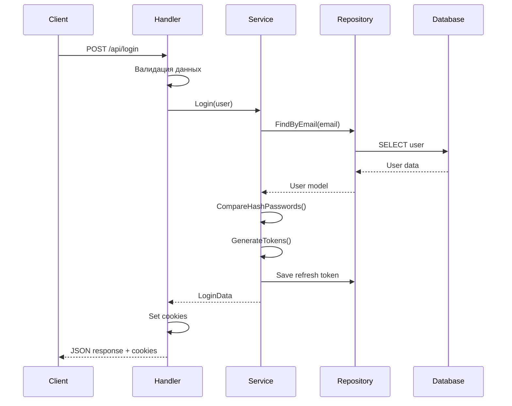
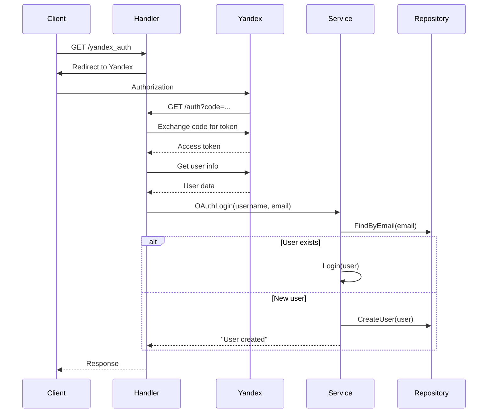

# Архитектура модуля аутентификации

## 🏗 Обзор архитектуры

Модуль аутентификации построен по принципам **Clean Architecture** с четким разделением слоев ответственности. Архитектура следует паттерну **Repository** и **Service** для обеспечения тестируемости и поддерживаемости кода.

## 📐 Диаграмма архитектуры

```
┌─────────────────────────────────────────────────────────────┐
│                    HTTP Layer (Handlers)                    │
├─────────────────────────────────────────────────────────────┤
│                   Business Layer (Services)                │
├─────────────────────────────────────────────────────────────┤
│                  Data Access Layer (Repository)             │
├─────────────────────────────────────────────────────────────┤
│                      Database Layer                        │
└─────────────────────────────────────────────────────────────┘
```

## 🧩 Компоненты системы

### 1. HTTP Layer (Слой представления)

**Расположение**: `internal/handlers/`

**Ответственность**:
- Обработка HTTP запросов
- Валидация входных данных
- Форматирование ответов
- Управление сессиями через куки

**Основные компоненты**:

#### `AuthHandlers`
```go
type AuthHandlers struct {
    UserService services.UserService
}
```

**Методы**:
- `LoginHandler()` - обработка входа в систему
- `SignUpHandler()` - обработка регистрации
- `LogoutHandler()` - обработка выхода
- `AuthYandexHandler()` - инициация OAuth
- `LoginYandexHandler()` - обработка OAuth callback

### 2. Business Layer (Слой бизнес-логики)

**Расположение**: `internal/services/`

**Ответственность**:
- Реализация бизнес-правил
- Координация между компонентами
- Управление транзакциями
- Валидация бизнес-логики

#### `UserService`
```go
type UserService interface {
    Login(user *models.User) (*LoginData, error)
    OAuthLogin(username, email string) (*LoginData, error)
    Logout(token string) error
    SignUp(user *models.User) (*LoginData, error)
    SetPassword(user *models.User) error 
    GetUserByEmail(email string) (*models.User, error)
}
```

**Основные операции**:
- **Login**: аутентификация пользователя
- **OAuthLogin**: вход через OAuth провайдера
- **SignUp**: регистрация нового пользователя
- **Logout**: завершение сессии
- **SetPassword**: установка пароля для OAuth пользователей

#### `TokenService`
```go
type TokenService interface {
    GenerateRefreshToken(userId uuid.UUID) (string, error)
    GenerateAccessToken(userId uuid.UUID) (string, error)
    RevokeRefreshToken(userID uuid.UUID) error
    ParseRefreshToken(tokenString string) (string, error)
}
```

**Функции**:
- Генерация JWT токенов
- Управление refresh токенами
- Валидация токенов
- Отзыв токенов

### 3. Data Access Layer (Слой доступа к данным)

**Расположение**: `internal/repository/`

**Ответственность**:
- Абстракция доступа к данным
- Выполнение SQL запросов
- Маппинг данных в модели

#### `UserRepo`
```go
type UserRepo interface {
    FindByEmail(email string) (*models.User, error)
    CreateUser(user *models.User) error
    SetPassword(user *models.User) error
}
```

#### `TokenRepo`
```go
type TokenRepo interface {
    Save(userId, tokenId uuid.UUID, tokenString string) error
    DeleteByID(tokenID uuid.UUID) error
}
```

### 4. Models (Модели данных)

**Расположение**: `internal/models/`

#### `User`
```go
type User struct {
    ID        uuid.UUID  `db:"id"`
    CreatedAt time.Time  `db:"created_at"`
    DeletedAt *time.Time `db:"deleted_at"`
    UpdatedAt *time.Time `db:"updated_at"`
    Username  string     `json:"username" db:"username"`
    Email     string     `json:"email" db:"email"`
    Password  string     `json:"password" db:"password"`
}
```

#### `RefreshTokens`
```go
type RefreshTokens struct {
    UserID  uuid.UUID `json:"user_id"`
    TokenID uuid.UUID `json:"token_id"`
    Token   string    `json:"token"`
}
```

## 🔄 Потоки данных

### 1. Процесс входа в систему



### 2. OAuth процесс



## 🗄 Структура базы данных

### Таблица `users`
```sql
CREATE TABLE users (
    id UUID PRIMARY KEY DEFAULT gen_random_uuid(),
    created_at TIMESTAMP NOT NULL DEFAULT NOW(),
    updated_at TIMESTAMP,
    deleted_at TIMESTAMP,
    username VARCHAR(255) NOT NULL,
    email VARCHAR(255) UNIQUE NOT NULL,
    password VARCHAR(255) NOT NULL
);
```

### Таблица `refresh_tokens`
```sql
CREATE TABLE refresh_tokens (
    user_id UUID NOT NULL REFERENCES users(id),
    token_id UUID PRIMARY KEY DEFAULT gen_random_uuid(),
    token TEXT NOT NULL,
    created_at TIMESTAMP NOT NULL DEFAULT NOW()
);
```

## 🔧 Вспомогательные компоненты

### Database Connection Pool
**Расположение**: `internal/database/`

- Управление пулом соединений PostgreSQL
- Конфигурация параметров пула
- Health checks соединений

### Logger
**Расположение**: `logger/`

- Структурированное логирование через zap
- Конфигурация уровней логирования
- Централизованное управление логами

### Responses
**Расположение**: `responses/`

- Форматирование HTTP ответов
- Рендеринг HTML шаблонов
- Стандартизация JSON ответов

### Utils
**Расположение**: `internal/utils/`

- Хеширование паролей (bcrypt)
- Сравнение паролей
- Вспомогательные функции безопасности

## 🔒 Безопасность

### Аутентификация
- **bcrypt** для хеширования паролей (cost=16)
- **JWT** токены с HMAC-SHA256 подписью
- **Refresh токены** хранятся в базе данных

### Защита сессий
- **HttpOnly** куки (защита от XSS)
- **Secure** флаг (только HTTPS)
- **SameSite** защита от CSRF
- Короткое время жизни access токенов (5 минут)

### OAuth безопасность
- Проверка **state** параметра
- Валидация **redirect_uri**
- Безопасный обмен кода на токен

## 🧪 Тестирование

### Структура тестов
```
tests/
├── integration/     # Интеграционные тесты
│   ├── login_test.go
│   ├── logout_test.go
│   └── signUp_test.go
└── unit/           # Unit тесты
```

### Тестовые утилиты
- **Testcontainers** для изоляции тестов
- **PostgreSQL** контейнер для тестов
- **Helpers** для создания тестовых данных

## 📈 Производительность

### Оптимизации
- **Connection pooling** для базы данных
- **JWT** токены без состояния
- **Минимальные** запросы к базе данных
- **Кэширование** refresh токенов

### Мониторинг
- Структурированные логи
- Метрики производительности
- Health checks

## 🔄 Расширяемость

### Добавление новых OAuth провайдеров
1. Реализовать новый endpoint в `handlers`
2. Добавить конфигурацию в `configs`
3. Расширить `UserService` при необходимости

### Добавление новых методов аутентификации
1. Создать новый метод в `UserService`
2. Добавить соответствующий handler
3. Обновить модели данных при необходимости

## 📝 Принципы разработки

1. **Separation of Concerns** - четкое разделение ответственности
2. **Dependency Injection** - инверсия зависимостей
3. **Interface Segregation** - маленькие, специализированные интерфейсы
4. **Single Responsibility** - один класс = одна ответственность
5. **Testability** - все компоненты легко тестируются

## 🚀 Будущие улучшения

- [ ] Middleware для авторизации
- [ ] Rate limiting
- [ ] Двухфакторная аутентификация
- [ ] Refresh token rotation
- [ ] Audit logging
- [ ] Metrics и monitoring


