# Диаграммы архитектуры модуля аутентификации

## 🏗 Общая архитектура

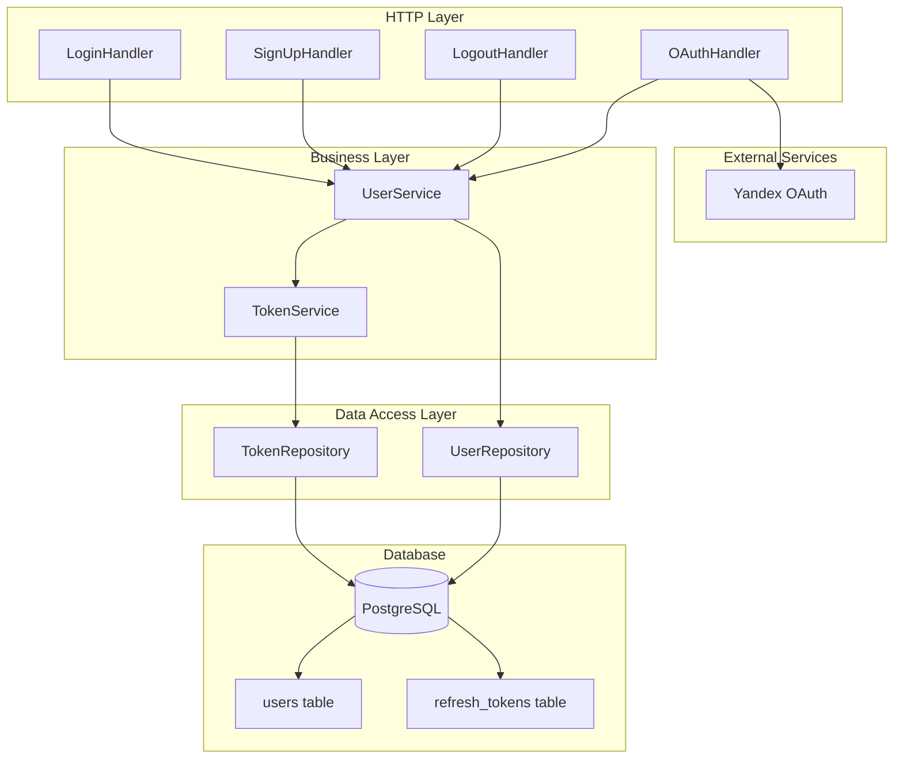

## 🔄 Процесс входа в систему

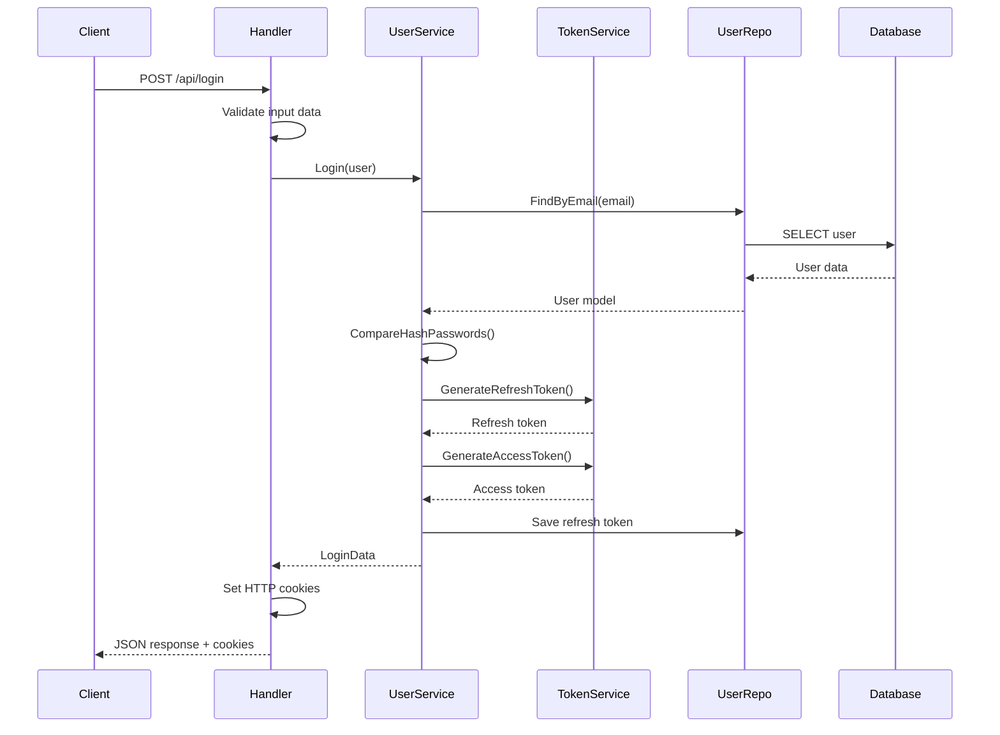

## 🔐 Процесс регистрации

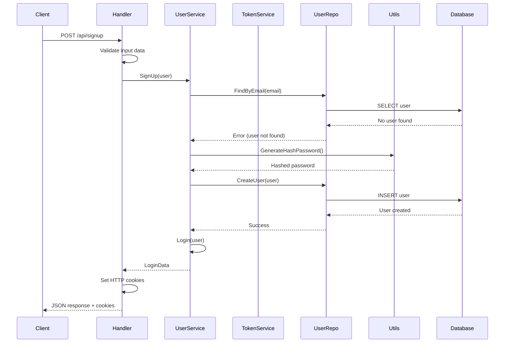

## 🌐 OAuth процесс (Яндекс)

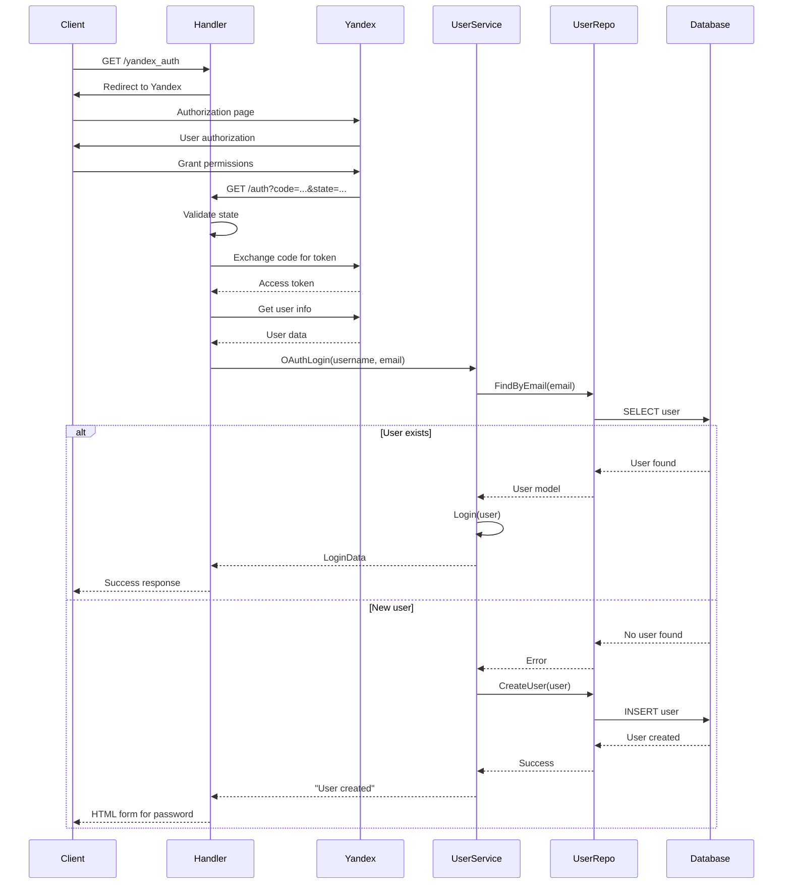

## 🚪 Процесс выхода из системы

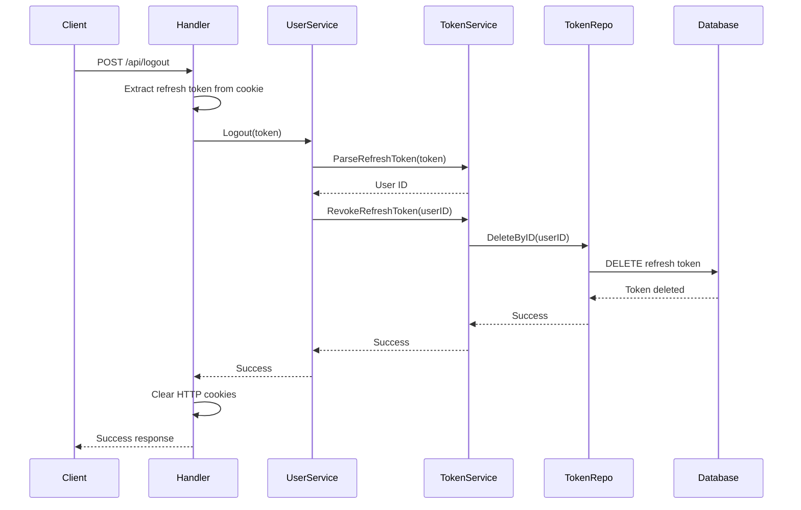

## 🗄 Структура базы данных

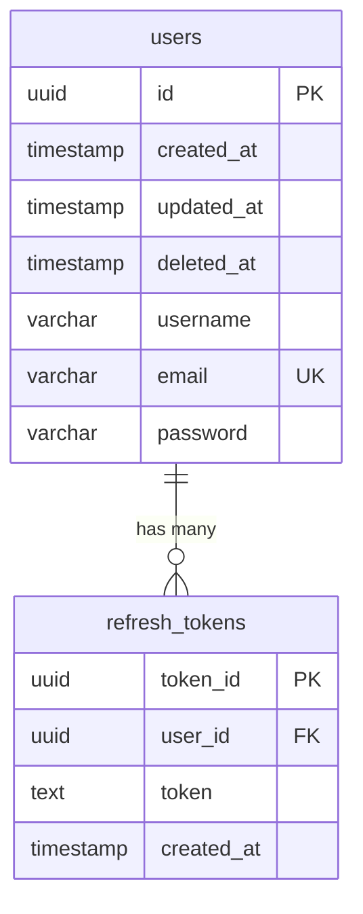

## 🔧 Компоненты и зависимости

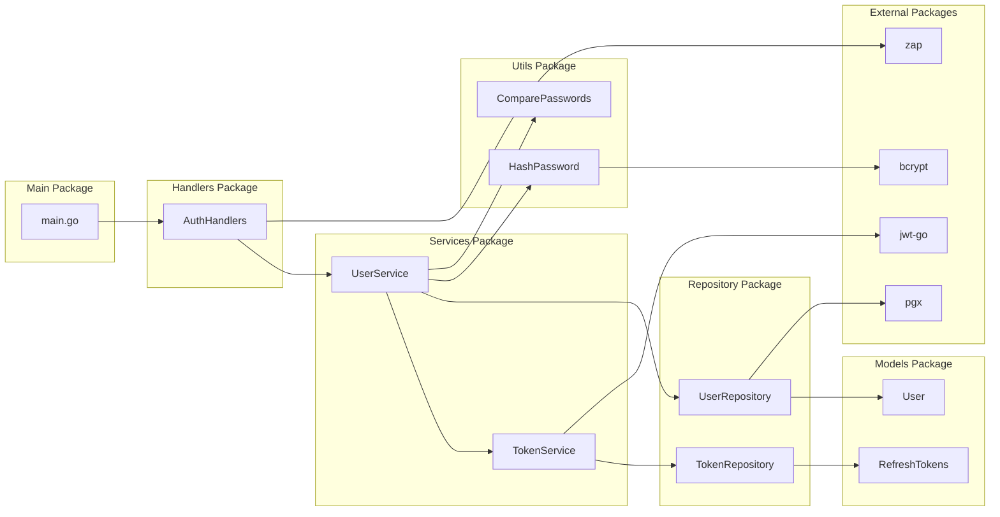

## 🔒 Безопасность и токены

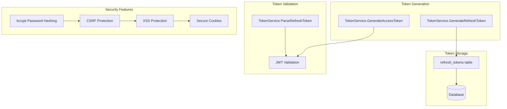

## 📊 Потоки данных

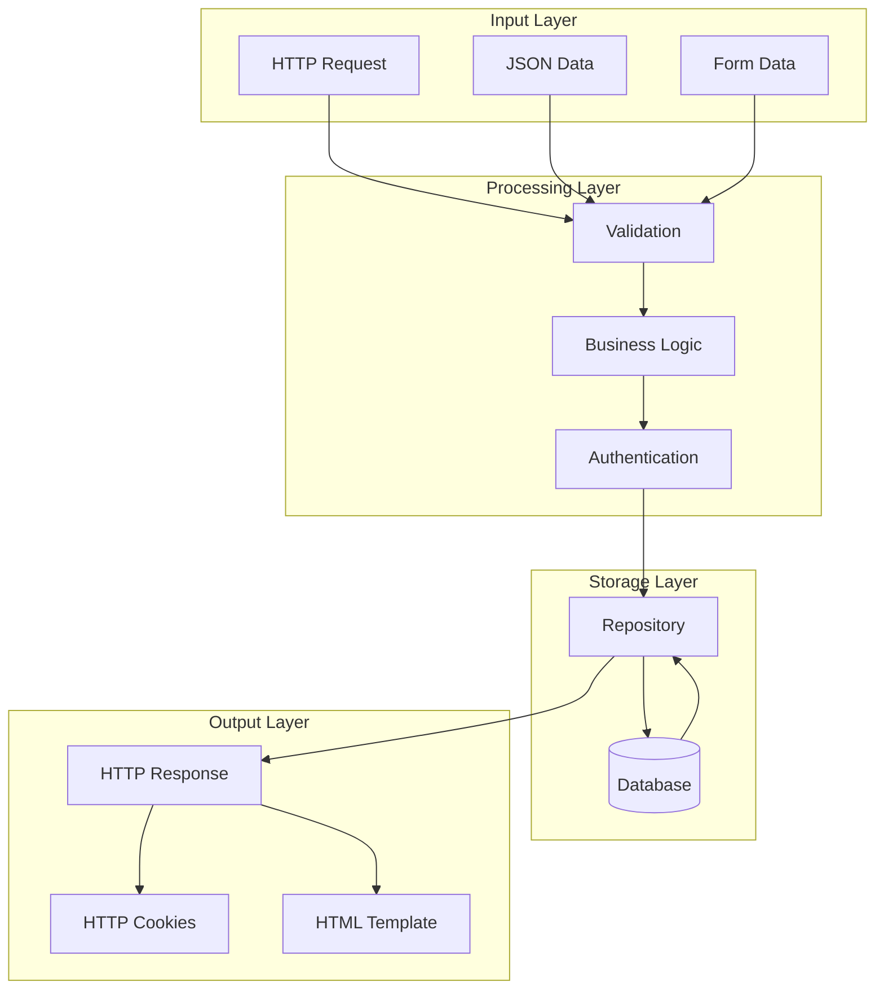

## 🧪 Тестирование

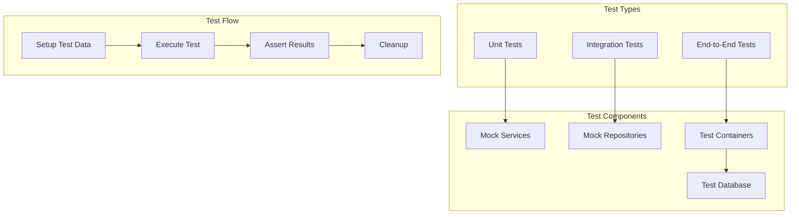

## 🔄 Жизненный цикл токенов

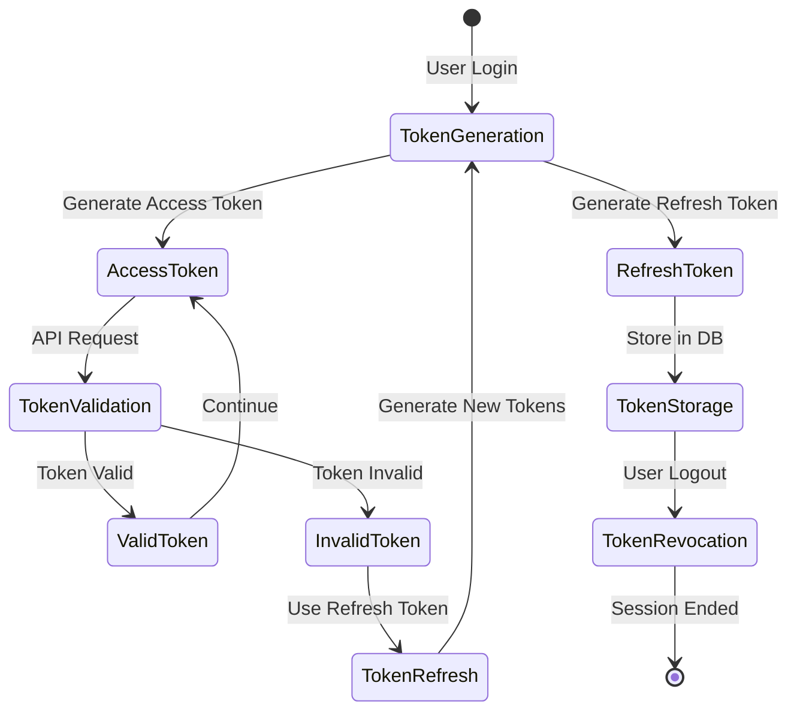

Эти диаграммы помогают визуализировать архитектуру и процессы модуля аутентификации, что облегчает понимание системы для новых разработчиков.

